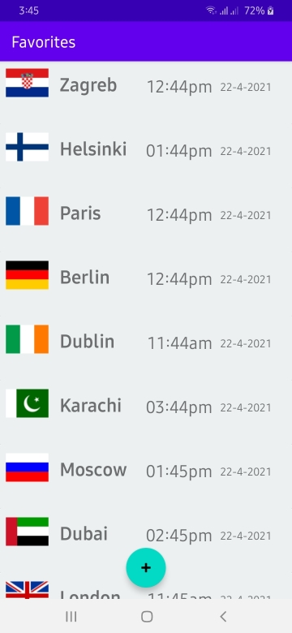

# World-Clock
Android app that shows all the available time zone cities and their current time.

The app has 2 screens i.e. 
1. The activity that contains all the time zone cities, these can be checked/unchecked to add/remove them from the main activity.

2. The main activity that shows all the selected cities in a card view.

